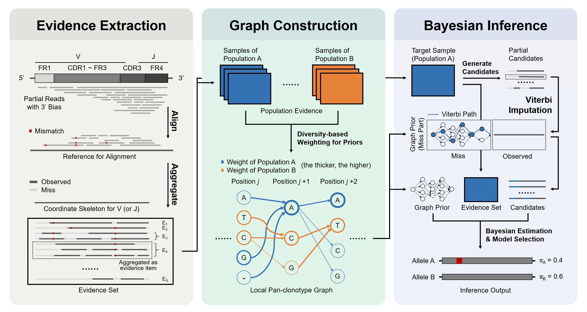

# PanTCR: Robust Inference of Novel TCR Alleles from Fragmented RNA-seq Data via Pan-clonotype Graph Priors

This repository contains the implementation and reproduction pipeline for **PanTCR**, a tool designed to infer novel TCR alleles from fragmented RNA-seq data using pan-clonotype graph priors.



---

## Prerequisites

Before running the pipeline, ensure your system meets the following requirements:

- **OS**: Linux or macOS  
- **Python**: 3.8 or higher  
- **Conda**: Recommended for environment management  
- **Java**: Required for MiXCR (v4.0 or higher recommended)

---

## Installation & Setup

### 1. Create and Activate Environment

We recommend using Conda to create an isolated environment to avoid dependency conflicts.

```bash
# Create a new conda environment named 'pantcr'
conda create -n pantcr python=3.9 -y

# Activate the environment
conda activate pantcr
```

---

### 2. Install Python Dependencies

Install the required Python libraries (mainly `numpy` and `pandas`).

```bash
pip install -r requirements.txt
```

If you do not yet have a `requirements.txt`, create one with the following content:

```txt
numpy>=1.21.0
pandas>=1.3.0
openpyxl>=3.0.0
```

---

### 3. Install External Bioinformatics Tools

This pipeline relies on **MiXCR** (for alignment and allele calling) and **ART** (for NGS simulation).

#### ART (Illumina Simulator)

```bash
conda install -c bioconda art
```

#### MiXCR (Version 4.0+)

MiXCR must be installed and available in your system `PATH`.

- **Option A (Official Zip)**:  
  Download from the MiXCR website, unzip, and add it to your `PATH`.

- **Option B (Conda – verify version)**:  
  ```bash
  conda install -c bioconda mixcr
  ```
  Ensure the installed version is **v4.0+**. Otherwise, manual installation is required.

#### Verification

```bash
art_illumina --help
mixcr --version   # Must be >= 4.0
```

---

## Data Preparation

The source of data used in the experiments could be found in the Supplementary Table 1. 

As a demo, we provide the processed data of the SC-1 dataset in the 'example' folder, including the TRB rearrangement file generated by MiXCR (as the input) and the genotype file for evaluation (as the label). We also provided the pre-trained graphs in the 'pang' folder from the AIRR-1 dataset described in the paper.

Before running the simulation experiments, also need to unzip the reference CDR3 dictionary.

```bash
unzip simu/ref/cdr3_dict.zip -d simu/ref/
```

---

## Usage

1. First, after obtaining the input samples (.fastq files), use the MiXCR tool to do the sequence alignment and get the TRB rearrangement result:

```bash
mixcr analyze \
  -s hsa rna-seq \
  SC1.fastq.gz \
  example/SC1
```

2. Then process the rearrangement result and extract the mutation evidence:

```bash
# Create the result folder
mkdir -p results

# For V genes
python code/collect_mutationV6.py \
    --input 'example/SC1.clones_TRB.tsv' \
    --gene V \
    --ref ref/IMGT_TRBV_pro.tsv \
    --prefix 'results/SC1.V'

# For J genes
python code/collect_mutationV6.py \
    --input 'example/SC1.clones_TRB.tsv' \
    --gene J \
    --ref ref/IMGT_TRBJ_pro.tsv \
    --prefix 'results/SC1.J'
```

where the --input parameter denotes the rearrangement file and the --ref parameter denotes the corresponding IMGT reference file.

3. After obtaining the extracted evidence, use the pre-trained graphs for Beyesian inference and get the inference results:

```bash
# For V genes
python code/infer_genotype_bayes_v4.py 
    --sample_csv 'results/SC1.V' 
    --out 'results/infer_SC1.V.csv' 
    --pangenome_dir 'pang/V'

# For J genes
python code/infer_genotype_bayes_v4.py 
    --sample_csv 'results/SC1.J' 
    --out 'results/infer_SC1.J.csv' 
    --pangenome_dir 'pang/J'
```

You can also generate the customized graphs. Put all the evidence files (generated by Step 2) of population samples for constructing the graphs in one folder 'population' (seperate V and J files) and generate a metadata file about the population samples including the population information (like 'ref/metadata.csv'). Then construct the graphs with the commands:

```bash
# For V genes
mkdir -p pang_customized/V
python code/build_pangenome_graph_v7.py \
    --in_dir 'population/V' \
    --out_dir 'pang_customized/V' \
    --metadata 'ref/metadata' \
    --write_paths

# For J genes
mkdir -p pang_customized/J
python code/build_pangenome_graph_v7.py \
    --in_dir 'population/J' \
    --out_dir 'pang_customized/J' \
    --metadata 'ref/metadata' \
    --write_paths
```

4. Evaluate the inference results with the labels

```bash
# For V genes
python code/eval_alleles_without_CDR3.py --gt 'example/SC1.genotype.csv' --infer 'results/infer_SC1.V.csv' --index 'ref/TRB_index.csv' --gene_type 'V' --out_prefix 'results/eval_SC1.V'

# For J genes
python code/eval_alleles_without_CDR3.py --gt 'example/SC1.genotype.csv' --infer 'results/infer_SC1.J.csv' --index 'ref/TRB_index.csv' --gene_type 'J' --out_prefix 'results/eval_SC1.J'
```

where the --gt parameter denotes the label file, the --index parameter denotes the file recording the region index of the specific genes.

---

## Reproducing Simulation Experiments

The repository includes a comprehensive script to reproduce the simulation experiments described in the paper, including the synthetic data generation pipeline.

### Reproducing 5-Fold Cross-Validation (Default)

```bash
# Enter the simulation directory
cd simu

# Grant execution permissions (if necessary)
chmod +x simu_validation_pipeline.sh

# Run the pipeline
./simu_validation_pipeline.sh
```

### Customizing Experiments

You can modify experimental parameters (e.g., read length, depth, population, degradation levels) by:

- Editing the script `simu_validation_pipeline.sh`
- Passing command-line arguments if supported, e.g.:
  ```bash
  ./simu_validation_pipeline.sh --expr-id expr_1 --p-deg 0.9
  ```

Refer to the script comments for supported options.

### Output

Results are generated in the `simu/samples` directory (or a configured output path), organized by experiment ID and population.

Log files are available in:

```text
simu/logs
```

---

## Reproducing Pseudo-bulk RNA-seq Experiments

After downloading the processed bam file with 10X pipeline according to the URL, we generate the fastq files with the commands:

```bash
# Extract reads overlapping the TRB locus (chr7:142-143Mb) into a subset BAM file
samtools view -b input.sorted.bam 'chr7:142000000-143000000' > trb.region.bam

# Extract unique read IDs from the subset BAM to identify all fragments in this region
samtools view trb.region.bam | cut -f 1 | sort | uniq > read_names.txt

# Retrieve the full records (including mates outside the region) for these IDs from the original BAM
samtools view -b -N read_names.txt input.sorted.bam > trb.complete.bam

# Sort the resulting BAM by read name (required for proper FASTQ conversion of paired-end data)
samtools sort -n -@ 8 trb.complete.bam -o trb.complete.name_sorted.bam

# Convert the name-sorted BAM into a compressed FASTQ file for downstream analysis
samtools fastq -@ 8 -n trb.complete.name_sorted.bam | gzip > input.fastq.gz
```

---

## License

MIT License: only for acdamic use.

---

## Contact

Xinyang Qian: qianxy@stu.xjtu.edu.cn
